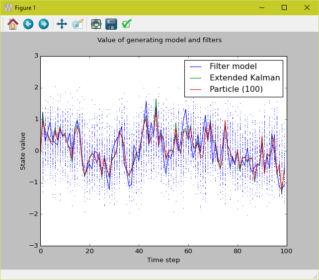
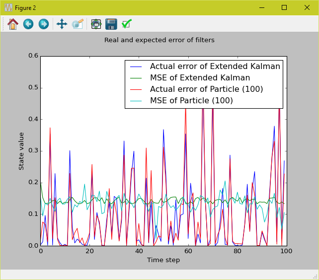

# Filters

All data can be 'fed in' in parts. The filter will update itself and its estimation.

A model can be created and simulated. The results are plotted but the estimations can also be extracted if needed.

### Kalman

Filters a process using a Kalman filter.

### Particle

Filters a process using a Particle filter.

## Examples

An example of a simulation using non-linear model:
```
x := x/(1+x^2) + v
y := x + w
```
with `v` and `w` white noise is generated with code like below:
```
model = FilterModel(NormalDistribution(10, 1), NoiseDistribution(0.5), NoiseDistribution(0.5), lambda x: x/(1+x*x), lambda x: (1-x*x)/(x*x+1)**2, lambda x: x, lambda _: 1)
simulate(n, model, 100, T)
```

The results would look like the following:





Look for more examples in [the main code](main.py).
